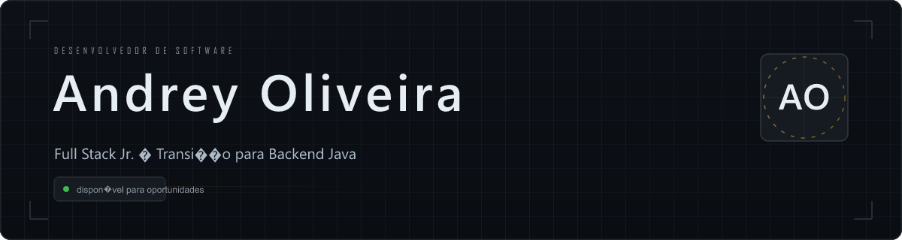
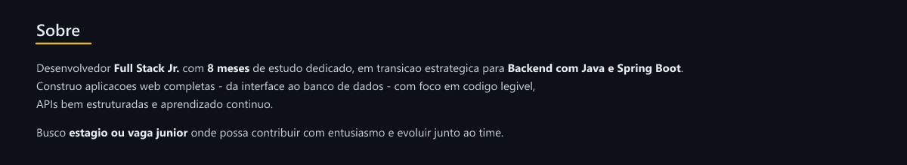
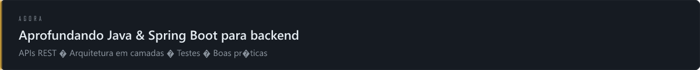
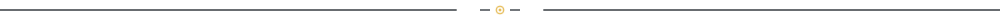
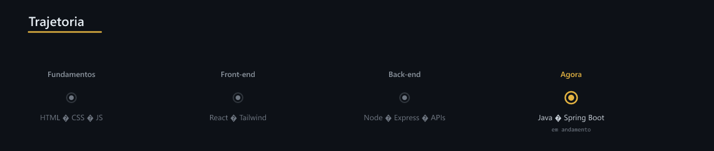
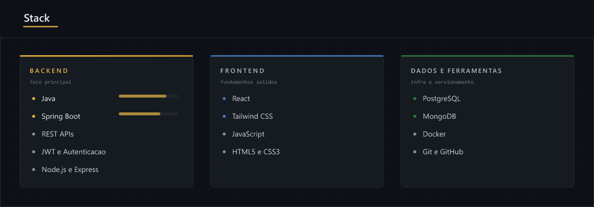
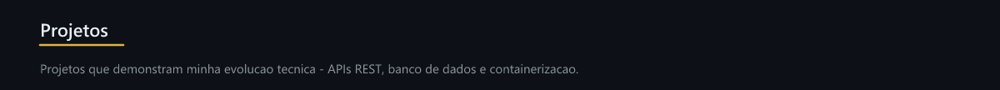
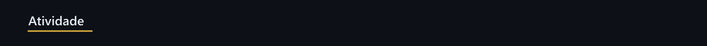
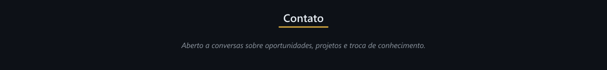

<!--
  Perfil de Andrey Oliveira — AndreyODev
  100% baseado em PNGs com fundo preto.
  Sem texto solto — tudo embutido nas imagens.
-->

  

  
  &nbsp;
  
  &nbsp;
  

  
  &nbsp;&nbsp;
  

<!-- Troféus -->

  

<!-- Estatísticas + Streak -->

  
  &nbsp;&nbsp;
  

<!-- Linguagens -->

  
  &nbsp;&nbsp;
  

<!-- Gráfico de Contribuições -->

  

  
    
  
  &nbsp;
  

  

