<!--
  Perfil de Andrey Oliveira - AndreyODev
  Identidade visual: preto absoluto (#000000) + acento latao (#E3B341).
  Cards com borda #1E1E22, no mesmo estilo do hero (assets/profile.svg).
  Faixas pretas (spacer-black.svg) ligam as secoes sem vao branco.
-->

<!-- HERO -->

<!-- Assinatura animada -->

<!-- Links -->
&nbsp;&nbsp;

<!-- ATIVIDADE (imagem unica gerada pelo GitHub Action - fundo preto) -->

<!-- CONTATO -->

&nbsp;

