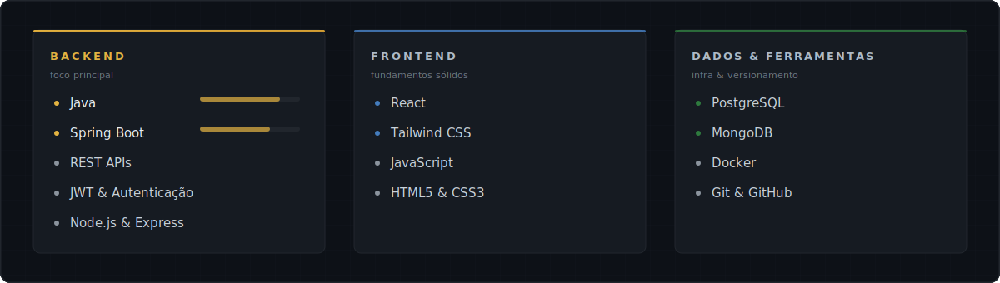
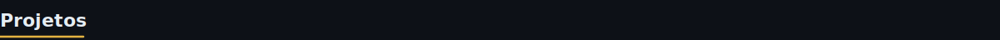

<!--
  Perfil de Andrey Oliveira
  Identidade visual: Estúdio de Engenharia — grafite + latão, estilo editorial.
  Repositório de perfil: github.com/AndreyODev/AndreyODev
-->

  

  
  &nbsp;
  
  &nbsp;
  

 

Desenvolvedor **Full Stack Jr.** com **8 meses** de estudo dedicado, em transição estratégica para **Backend com Java e Spring Boot**. Construo aplicações web completas — da interface ao banco de dados — com foco em código legível, APIs bem estruturadas e aprendizado contínuo.

Busco **estágio ou vaga júnior** onde possa contribuir com entusiasmo e evoluir junto ao time.

 

 

 

  

 

 

  

 

 

Projetos que demonstram minha evolução técnica — APIs REST, banco de dados e containerização.

  
  &nbsp;&nbsp;
  

 

 

  
  &nbsp;&nbsp;
  

  

 

 

  <i>Aberto a conversas sobre oportunidades, projetos e troca de conhecimento.</i>

  
    
  
  &nbsp;
  

 

  

