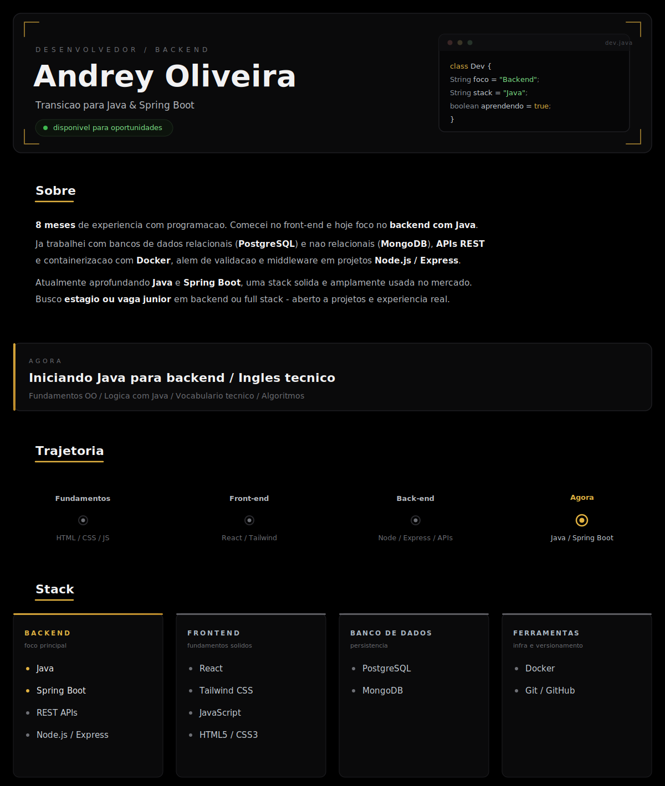
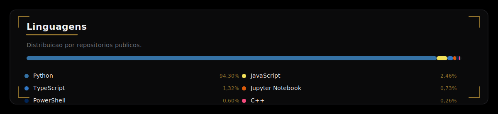
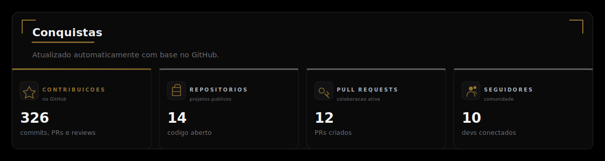

<!--
  Perfil de Andrey Oliveira - AndreyODev
  Identidade visual: preto absoluto (#000000) + card (#0A0A0B) + acento latao (#92732D).
  Conteudo estatico editavel: profile.svg, trofeus.svg e contato.svg.
  Indicadores dinamicos: linguagens.svg, Pac-Man e trofeus.svg (gerados automaticamente pelo GitHub Action).
-->

<!-- HERO -->

<!-- LINGUAGENS (gerado pelo GitHub Action) -->

<!-- ATIVIDADE: Pac-Man com moldura escura (gerado pelo workflow pacman.yml na branch output) -->

<!-- CONQUISTAS -->

<!-- CONTATO -->

<map name="contato-map">
  <area shape="rect" coords="24,136,300,296" href="mailto:andreyoliveira72005@gmail.com" alt="Email" />
  <area shape="rect" coords="316,136,592,296" href="https://www.linkedin.com/in/andrey-oliveira-dev/" alt="LinkedIn" target="_blank" />
  <area shape="rect" coords="608,136,884,296" href="https://wa.me/5522997568439" alt="WhatsApp" target="_blank" />
  <area shape="rect" coords="900,136,1176,296" href="https://andreyodev.github.io/" alt="Portfolio" target="_blank" />
</map>

